<div align="center">

<p align="center">
  
</p>

# Karma

**The Personal Circularity Decision Engine**

Make what you own count for more. Scan, compare, repair, and turn everyday consumption into verifiable carbon credit scores and real-world rewards.

Built with Expo 57 &bull; React Native 0.79 &bull; FastAPI &bull; Python 3.12 &bull; Google Gemini Vision &bull; UniWind (Tailwind CSS v4)


[](https://reactnative.dev/)
[](https://expo.dev/)
[](https://www.typescriptlang.org/)
[](https://fastapi.tiangolo.com/)
[](https://www.python.org/)
[](https://ai.google.dev/)
[](https://tailwindcss.com/)
[](https://pnpm.io/)

<br><br>

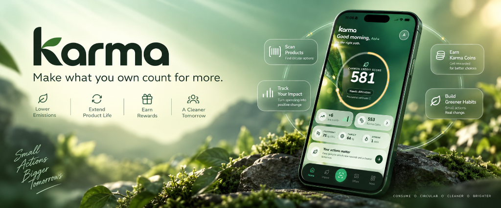

</div>

***

## Table of Contents

* [Hackathon Problem Statement](#hackathon-problem-statement)
* [Why Karma?](#why-karma)
* [App Experience](#app-experience)
* [Overview](#overview)
* [Features](#features)
* [The Carbon Credit Score (KCS)](#the-karma-credit-score-kcs)
* [Tech Stack](#tech-stack)
* [Architecture](#architecture)
* [Getting Started](#getting-started)
* [Environment Variables](#environment-variables)
* [Database & Domain Models](#database--domain-models)
* [Project Structure](#project-structure)
* [App Routes](#app-routes)
* [Demo Sandbox (Evaluator Quickstart)](#demo-sandbox-evaluator-quickstart)
* [Deployment](#deployment)

***

## Hackathon Problem Statement

> **THEME: CIRCULAR CARBON ECOSYSTEM**  
> **Consumer Carbon Loop App**  
>  
> **Description:**  
> Everyday consumers have little visibility into their personal carbon footprint and few easy ways to act on it. This problem asks participants to build an app that estimates a user's carbon footprint from purchases, transport, and energy use, then suggests concrete circular actions &mdash; repair vs. replace decisions, nearby recycling drop points, or verified offset options &mdash; and rewards users for taking action.  
>  
> **User:**  
> Individual consumers, eco-conscious brands, recycling facilities.  
>  
> **Impact:**  
> &bull; Raises consumer awareness of everyday carbon impact.  
> &bull; Drives behavior change toward circular consumption habits.  
> &bull; Creates a channel for brands to reward sustainable customer behavior.  
>  
> **Tech that can be used:**  
> &bull; Mobile app development  
> &bull; Transaction categorization (NLP/ML)  
> &bull; Location-based APIs (recycling points)  
> &bull; Gamification engines  

***

## Why Karma?

The name **Karma** is rooted in the universal principle of cause and effect: every action inevitably generates a consequence. In modern consumer society, every purchase, discard, and replacement decision ripples through global supply chains, extraction networks, and municipal waste streams.

For decades, digital environmental tools have treated this dynamic as an inescapable burden of guilt. They have presented consumers with abstract metric tons of emissions, urged austerity, and demanded that individuals simply consume less. But guilt is not an effective catalyst for long-term behavioral transformation, and deprivation cannot build sustainable habits.

**Karma alters this dynamic fundamentally.**

Within this ecosystem:
* **Conscious Action Generates Direct Value**: Every beneficial circular decision &mdash; restoring a broken phone screen, keeping garments in active circulation, commuting on public transit, or depositing e-waste at a certified hub &mdash; is quantified, validated, and rewarded.
* **Circularity as an Earned Asset**: Instead of treating individuals as net-negative carbon liabilities, Karma conceptualizes circular living through the lens of creditworthiness. Members build an authoritative **Carbon Credit Score (KCS)**, accumulate liquid **Karma Coins**, and unlock substantial economic benefits including verified government environmental subsidies and partner merchant incentives.
* **Closing the Economic Loop**: Constructive deeds yield tangible returns. Possessions that would otherwise enter landfills are transformed into financial utility, positioning consumers as empowered participants within a high-value circular economy.

*"Make what you own count for more."*

***

## App Experience

<table align="center" width="100%">
  <tr>
    <td align="center" width="25%">
      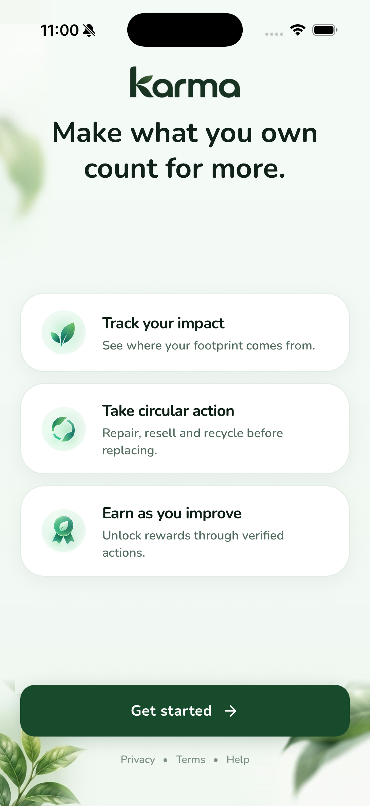
    </td>
    <td align="center" width="25%">
      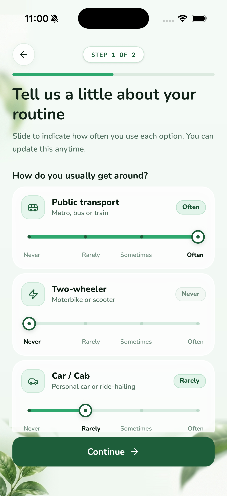
    </td>
    <td align="center" width="25%">
      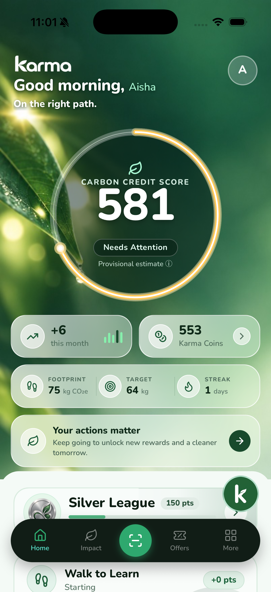
    </td>
    <td align="center" width="25%">
      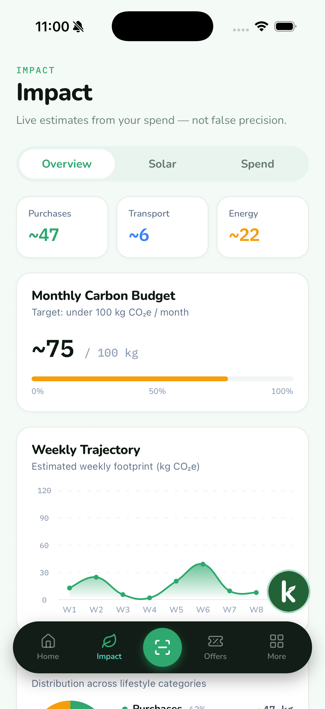
    </td>
  </tr>
  <tr>
    <td align="center" valign="top"><strong>1. Onboarding</strong></td>
    <td align="center" valign="top"><strong>2. Baseline Calibration</strong></td>
    <td align="center" valign="top"><strong>3. Home Dashboard</strong></td>
    <td align="center" valign="top"><strong>4. Footprint & Budget</strong></td>
  </tr>
  <tr>
    <td align="center" width="25%">
      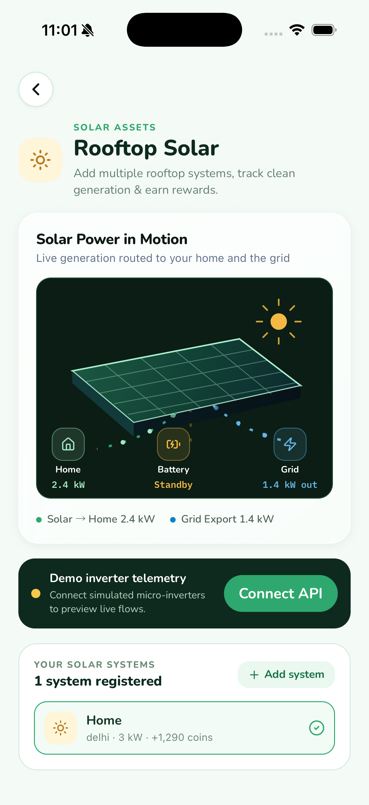
    </td>
    <td align="center" width="25%">
      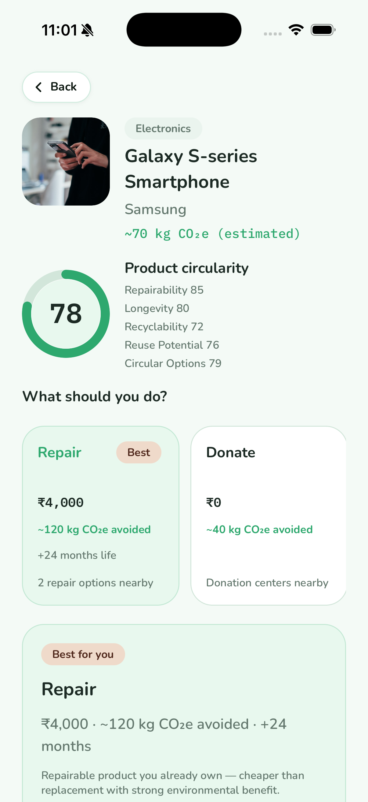
    </td>
    <td align="center" width="25%">
      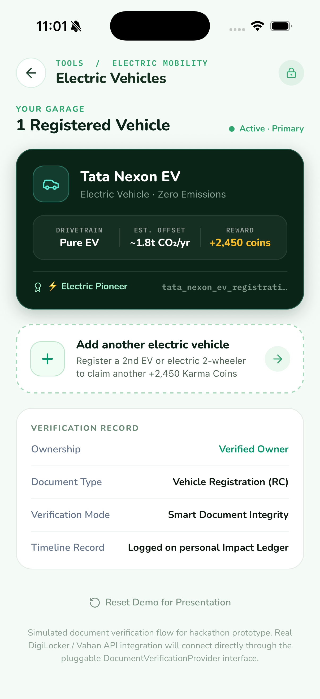
    </td>
    <td align="center" width="25%">
      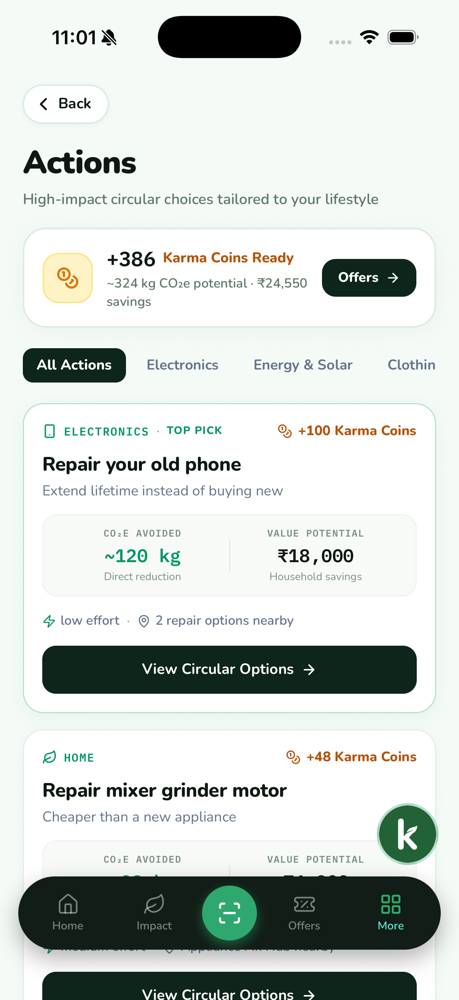
    </td>
  </tr>
  <tr>
    <td align="center" valign="top"><strong>5. Solar & Clean Assets</strong></td>
    <td align="center" valign="top"><strong>6. Decision Engine</strong></td>
    <td align="center" valign="top"><strong>7. AI Receipt Audit</strong></td>
    <td align="center" valign="top"><strong>8. Concrete Actions</strong></td>
  </tr>
  <tr>
    <td align="center" width="25%">
      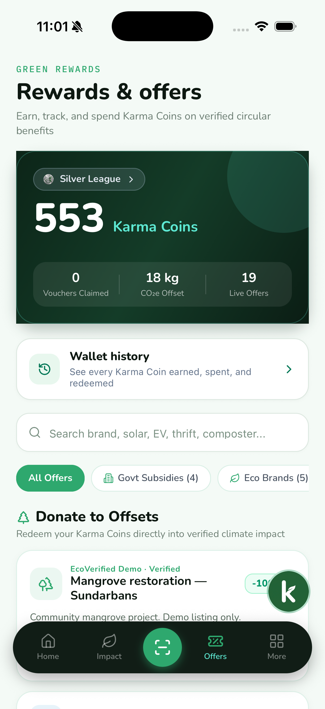
    </td>
    <td align="center" width="25%">
      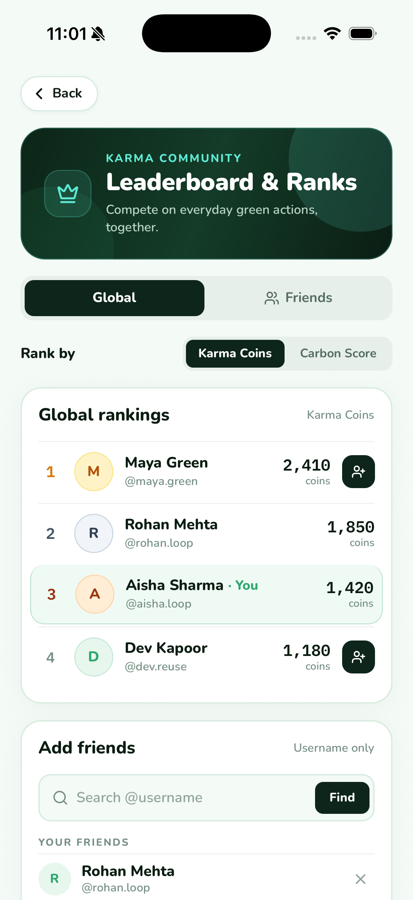
    </td>
    <td align="center" width="25%">
      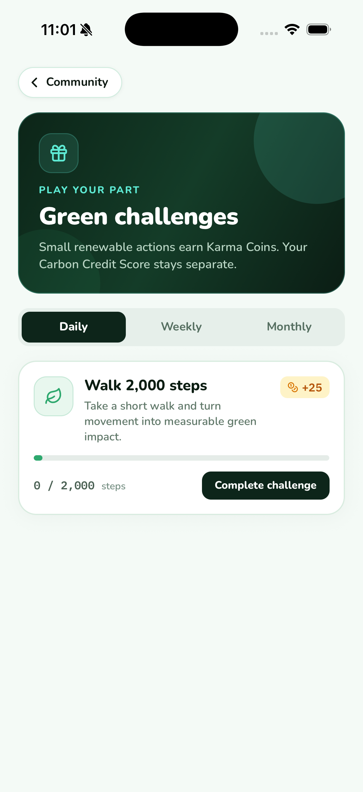
    </td>
    <td align="center" width="25%">
      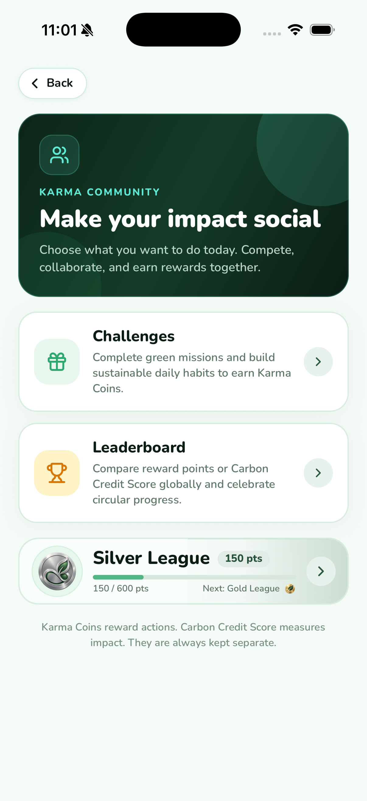
    </td>
  </tr>
  <tr>
    <td align="center" valign="top"><strong>9. Rewards & Subsidies</strong></td>
    <td align="center" valign="top"><strong>10. Circular Leagues</strong></td>
    <td align="center" valign="top"><strong>11. Quests & Challenges</strong></td>
    <td align="center" valign="top"><strong>12. Community Hub</strong></td>
  </tr>
</table>

<br>

| Screen | Focus Area | Key Capabilities |
| :--- | :--- | :--- |
| **1. Onboarding** | Product Introduction | Core circular living value proposition, biometric sign-in, and guided eco-persona setup |
| **2. Baseline Calibration** | Routine Calibration | Commute modes, weekly shopping habits, and household consumption baseline calibration |
| **3. Home Dashboard** | Real-Time Command Center | Dynamic KCS 581 progress ring, calibrated monthly carbon budget (75 kg / 100 kg), habit streaks, and Walk & Earn tracking |
| **4. Footprint & Budget** | Impact Analytics | Multi-category spend emissions breakdown, monthly budget pulse, and 8-week reduction trajectory |
| **5. Solar & Clean Assets** | Clean Energy Telemetry | Real-time rooftop solar generation, inverter efficiency, battery reserve status, and grid offset yield |
| **6. Decision Engine** | Real-Time Product Intelligence | Barcode scan, durability scoring, repairability index, and lifetime footprint vs replacement delta |
| **7. AI Receipt Audit** | Multi-Modal Document AI | Google Gemini Vision receipt parsing, automated sustainable item categorization, and instant Karma Coin rewards |
| **8. Concrete Actions** | Circular Interventions | Repair vs replace matrix, certified local technician matching, e-waste drop locator, and resale estimators |
| **9. Rewards & Subsidies** | Value Realization | Karma Coin redemptions for govt green transit passes, EV charging vouchers, and circular brand discounts |
| **10. Circular Leagues** | Gamified Community | Tier-based competitive circular ladders, regional carbon-saved rankings, and peer milestones |
| **11. Quests & Challenges** | Habit Formation | Daily eco challenges, zero-waste weekend missions, verified action bounties, and mystery lootboxes |
| **12. Community Hub** | Local Infrastructure | Interactive map of neighborhood tool libraries, verified repair cafes, certified recycling points, and peer swap zones |

***

## Overview

Karma is a full-stack personal circularity decision platform designed to convert passive consumer awareness into active, economically rewarding climate habits.

The modern consumer landscape is engineered around planned obsolescence and low-friction replacement. When a smartphone battery degrades, a garment seam splits, or a small appliance malfunctions, consumers face an asymmetric dilemma: spend hours hunting for a local technician, or press "Buy Now" for next-morning doorstep delivery.

Karma bridges this friction. By scanning physical barcodes, ingesting utility bills via multi-modal AI, and passively tracking green commutes, the platform calculates exact lifecycle emissions across six circular pathways, calculates immediate financial savings, and turns verified actions into liquid Karma Coins and an authoritative Carbon Credit Score (KCS).

The mobile client is engineered with React Native 0.79 and Expo 57, featuring a custom glass floating dock, tactile haptic feedback, dark/light ambient tokens via UniWind, and hardware sensor integration.

***

## Features

### Circularity Decision Engine (6 Pathways)

* **Multi-Pathway Comparison**: Instant comparative analysis of all six lifecycle routes: **Repair**, **Refurbish**, **Resell**, **Recycle**, **Donate**, and **Landfill**.
* **Precise Financial ROI**: Real-time monetary comparison showing repair cost vs replacement purchase cost.
* **Emissions Avoidance Accounting**: Quantifies embodied emissions preserved (e.g. ~120 kg CO2e saved by repairing an existing smartphone).
* **Vetted Service Directory**: Direct routing to verified local repair technicians, e-waste centers, and donation drop-offs.

### Multi-Modal AI Document Extraction

* **Bill & Invoice Parsing**: Camera capture, photo library upload, or PDF document ingestion powered by Google Gemini Vision.
* **Automatic Spend Classification**: Extracts line items and categorizes transactions into Electricity, Electronics, Groceries, Delivery, and Transit.
* **Emission Factor Mapping**: Translates raw currency spend into estimated kilograms of CO2e using regional conversion factors.
* **Fast Ingestion Microservice**: Next.js 15 microservice on port 8001 providing rapid streaming extraction to the mobile client.

### Carbon Credit Score (KCS) & Gamification

* **Dynamic Progress Ring**: Visual indicator scaling from 480 to 820 points based on validated circular choices.
* **Habit Streaks**: Weekly and monthly consistency tracking that accelerates point accumulation.
* **Live Footprint Pulse**: Interactive gradient area chart charting transaction-level emissions week over week.
* **Category Budgets**: Monthly carbon targets across purchases, transit, and household energy.

### Government Subsidies & Brand Rewards

* **Government Clean Energy Subsidies**: Direct access to verified public incentives (PM Surya Ghar Solar rooftop subsidies, FAME-II EV incentives, Star-rated appliance rebates).
* **Brand Eco Vouchers**: Redeemable points for discounts on sustainable retail brands, zero-waste products, and repair services.
* **Real-Time Point Ledger**: Complete ledger transparency tracking points awarded, spent, and balances.

### Direct In-App Carbon Offsets

* **Zero-Middleman Project Funding**: Direct point allocation toward verified climate projects:
  * **Western Ghats Rainforest Revival**: High-biodiversity native species reforestation.
  * **Sundarbans Coastal Mangrove Protection**: High-permanence coastal blue carbon restoration.
  * **Community Solar Grids**: Decentralized rural clean energy infrastructure.
* **Digital Certificates**: Instant verifiable certificate generated in the user's profile.

### Automated Commute & Pedestrian Offsets

* **Passive Transit Detection**: CoreLocation GPS speed and distance tracking automatically distinguishes walking, cycling, and motorized travel.
* **Step Pedometer Sync**: CoreMotion step counting measures zero-emission pedestrian travel, computing avoided vehicular emissions and awarding points daily.

***

## The Carbon Credit Score (KCS)

The Karma Credit Score is an index ranging from **480 to 820**, modeled on standard financial creditworthiness metrics. It evaluates how effectively an individual extends product lifecycles and minimizes avoidable emissions.

```text
+-----------------------------------------------------------------------+
|  KCS Range  |  Tier Name           |  Perks & Subsidies Unlocked      |
+-----------------------------------------------------------------------+
|  480 - 579  |  Developing Tier     |  Standard merchant coupons       |
|  580 - 669  |  Emerging Circular   |  5% bonus on repair point grants |
|  670 - 749  |  Active Guardian     |  Access to municipal subsidies   |
|  750 - 820  |  Pinnacle Circular   |  Priority grants & top subsidies |
+-----------------------------------------------------------------------+
```

### Mathematical Formula

$$\text{KCS} = \text{Baseline} + (\Delta_{\text{action}} \times \alpha) - (\text{Excess Footprint} \times \beta) + (\text{Streak Bonus})$$

* $\Delta_{\text{action}}$: Verified kg CO2e saved through repairs, resales, recycling, and green transit.
* $\alpha$: Category multiplier weighting high-impact decisions (electronics repair = 1.4x, textile resale = 1.1x).
* $\text{Excess Footprint}$: Emissions recorded above the personalized monthly carbon budget.
* $\text{Streak Bonus}$: Tiered reward for maintaining consecutive circular habit check-ins.

***

## Tech Stack

| Layer | Technology | Specification |
| :--- | :--- | :--- |
| **Mobile Client** | React Native 0.79 / Expo SDK 57 | Cross-platform iOS & Android mobile application |
| **Styling & Theme** | UniWind (Tailwind CSS v4) | Glassmorphism, fluid tokens, dark & light palette |
| **Component Primitives** | gluestack-ui v5 | Accessible native primitives and motion layouts |
| **Iconography** | Lucide React Native | Lightweight, clean stroke icons |
| **Core API** | Python 3.12 / FastAPI | High-performance asynchronous REST backend |
| **Data Validation** | Pydantic v2 | Strict typed request/response contracts |
| **AI Vision Engine** | Google Gemini Vision API | Multi-modal document and receipt intelligence |
| **AI Microservice** | Next.js 15 / Vercel AI SDK | Extraction microservice on port 8001 |
| **Hardware & Sensors** | CoreLocation & CoreMotion | GPS commute tracking and pedometer step sync |
| **Workspace & Tooling** | pnpm 9 / Turborepo | High-efficiency monorepo orchestrator |

***

## Architecture

```text
Client (React Native 0.79 / Expo 57)
    |
    |-- Native Sensors (CoreMotion / GPS) ---> Pedometer & commute detection
    |
    |-- REST API Client ---------------------> FastAPI (apps/api :8000)
    |                                              |
    |                                              +-- Circularity Engine (6 Pathways)
    |                                              +-- KCS Scoring Model (480-820)
    |                                              +-- Domain Lifecycle Database
    |                                              +-- Partner Subsidies & Offsets Hub
    |
    +-- Document Upload (Multi-Modal) -------> Next.js AI Service (apps/ai :8001)
                                                   |
                                                   v
                                               Google Gemini Vision API
```

### Key Architectural Decisions

* **Edge-First Sensor Aggregation**: GPS commute distances and step intervals are filtered on-device to eliminate sensor drift before batch syncing, preserving battery life and user privacy.
* **Decoupled AI Extraction Microservice**: Multi-modal vision processing runs on an independent Next.js microservice (`apps/ai`), isolating GPU-intensive inference calls from core REST API availability.
* **Deterministic KCS Index**: The scoring algorithm uses fixed mathematical bounds (480-820) rather than probabilistic guesses, guaranteeing repeatable audits and fair reward redemption.
* **Offline-Resilient Mobile Client**: React Native client incorporates fallbacks and local caches for all essential product circularity records, allowing barcode lookups even with intermittent connectivity.
* **Custom Glass Floating Dock**: Engineered custom floating dock tab bar (`_layout.tsx`) utilizing native safe-area insets, backdrop blur, and haptic feedback.

***

## Getting Started

### Prerequisites

* **Node.js** >= 20.x
* **pnpm** >= 9.x
* **Python** >= 3.11
* **Google AI Studio API Key** (for multi-modal receipt extraction)
* **iOS Simulator** (Xcode) or **Android Emulator** (Android Studio), or physical device with **Expo Go**

### Installation

```bash
# Clone the repository
git clone https://github.com/dhruv-programmes/karma.git
cd karma

# Install monorepo dependencies
pnpm install
```

### Launch Services

#### 1. Core API Service (FastAPI)

```bash
cd apps/api
python3 -m venv .venv
source .venv/bin/activate  # Windows: .venv\Scripts\activate
pip install -r requirements.txt
uvicorn app.main:app --reload --host 0.0.0.0 --port 8000
```
*Or from workspace root:* `pnpm api`

#### 2. Multi-Modal AI Document Service (Next.js)

```bash
cd apps/ai
pnpm install
cp .env.example .env.local
# Add your GOOGLE_GENERATIVE_AI_API_KEY to .env.local
pnpm dev
```
*Or from workspace root:* `pnpm ai` *(runs on port 8001)*

#### 3. Mobile Client (Expo)

```bash
cd apps/mobile
pnpm install
npx expo start --ios  # Or: npx expo start --android
```
*Or from workspace root:* `pnpm mobile`

***

## Environment Variables

Create the respective `.env` files in each service:

| Variable | Service | Description | Required |
| :--- | :--- | :--- | :---: |
| `GOOGLE_GENERATIVE_AI_API_KEY` | `apps/ai` | Google AI Studio API key for Gemini Vision receipt extraction | Yes |
| `FASTAPI_BASE_URL` | `apps/ai` | Upstream FastAPI backend URL (default: `http://localhost:8000`) | Yes |
| `AI_MODEL` | `apps/ai` | Gemini model name (default: `gemini-3.8-flash` or `gemini-2.0-flash`) | No |
| `EXPO_PUBLIC_API_URL` | `apps/mobile` | FastAPI backend URL (auto-resolves to LAN IP / `10.0.2.2` if omitted) | No |
| `EXPO_PUBLIC_AI_URL` | `apps/mobile` | AI extraction service URL (default: `http://localhost:8001`) | No |
| `PORT` | `apps/api` | Port to bind FastAPI server (default: `8000`) | No |
| `HOST` | `apps/api` | Host to bind FastAPI server (default: `0.0.0.0`) | No |

***

## Database & Domain Models

### Schema Overview

```text
User
 +-- BaselineProfile (transit routines, diet, shopping frequency)
 +-- CarbonFootprint (monthly budget, live kg CO2e, category split)
 +-- KarmaScore (KCS 480-820, trend delta, streak count)
 +-- CompletedActions (repairs, resales, recycling drop-offs)
 +-- CommuteTrips (GPS distance, duration, speed, awarded points)
 +-- Wallet (Karma Coins, claimed vouchers, offset certificates)

ProductCircularity
 +-- BarcodeIndex (EAN-13, UPC)
 +-- LifecycleEmissions (manufacturing, transit, packaging, disposal)
 +-- SixPathways (Repair, Resell, Refurbish, Recycle, Donate, Landfill)

OfferCatalog
 +-- GovernmentSubsidies (PM Surya Ghar, FAME-II EV, BEE Star)
 +-- BrandVouchers (eco merchants, thrift platforms, repair hubs)
 +-- VerifiedOffsets (Western Ghats, Mangrove protection, Solar)
```

***

## Project Structure

```text
carbon-loop-app/
+-- apps/
|   +-- mobile/                 # React Native & Expo 57 mobile application
|   |   +-- app/                # File-based router screens
|   |   |   +-- (tabs)/         # Home, tools, actions, impact, offers
|   |   |   +-- onboarding/     # Baseline routine, goal calibration, reveal
|   |   |   +-- receipt/        # Camera, photo, and PDF invoice scanning
|   |   |   +-- scan/           # Barcode & product circularity breakdown
|   |   |   +-- auth/           # Account creation and sign-in
|   |   +-- src/
|   |       +-- components/     # Score ring, glass dock, habit cards
|   |       +-- hooks/          # Commute GPS tracking, pedometer hooks
|   |       +-- lib/            # API client, normalizers, fallbacks
|   |       +-- theme/          # UniWind tokens, typography, layout
|   +-- api/                    # FastAPI core backend service
|   |   +-- app/
|   |       +-- main.py         # App factory, CORS, router mounts
|   |       +-- routers/        # Auth, products, actions, commute, KCS scoring
|   |       +-- services/       # Lifecycle calculator, baseline engine
|   |       +-- models/         # Pydantic schemas and domain entities
|   +-- ai/                     # Next.js 15 AI extraction microservice
|       +-- app/api/extract/    # Gemini multi-modal receipt extraction route
|       +-- lib/                # Vercel AI SDK client and prompt templates
+-- assets/
|   +-- banner.png              # Official Karma showcase hero banner
|   +-- screenshots/            # 12 showcase captures (01 through 12)
|   +-- app-icon.png            # Official Karma app icon
+-- package.json                # Turborepo / pnpm workspace root
+-- README.md                   # Enterprise technical documentation
```

***

## App Routes

| Path | Screen | Description |
| :--- | :--- | :--- |
| `/(tabs)` | Home | Carbon Credit Score (KCS 581) ring, habit tracker, and Walk & Earn card |
| `/(tabs)/tools` | Decision Tools | Hub for barcode scanner, bill import, recycling hubs, and offsets |
| `/(tabs)/actions` | Concrete Actions | Prioritized circular moves (repair vs replace, resale value, CO2e savings) |
| `/(tabs)/impact` | Impact Analytics | Spend-based emissions breakdown and weekly footprint pulse area chart |
| `/(tabs)/offers` | Coupons & Offsets | Karma Coin redemption, govt green subsidies, and certified climate offsets |
| `/onboarding` | Welcome | Core circular living value proposition and guided account creation |
| `/onboarding/baseline` | Routine Calibration | Commute modes, shopping frequency, and household consumption baseline |
| `/receipt` | Bill & Receipt Scanner | Multi-modal invoice ingestion via camera, photo gallery, or PDF |
| `/scan` | Barcode Scanner | Instant circular pathway evaluation for physical consumer products |

***

## Demo Sandbox (Evaluator Quickstart)

For authorized evaluators, judges, and enterprise partners testing the build:

### The 90-Second Hero Experience

1. **Launch App**: View your initial **Carbon Credit Score (KCS)** on the dynamic progress ring.
2. **Scan Item**: Tap the center **Scan** button and input or scan demo barcode `8901030865822` (Hero Smartphone).
3. **Compare Pathways**: Review the comparative analysis across all six circular pathways with precise financial savings versus emissions avoided.
4. **Initiate Repair**: Select **"Find Local Repair"** and complete a diagnostic action to earn **+100 Karma Coins**.
5. **Redeem Offers**: Open the **Coupons & Offsets** tab to apply points toward a **Government Green Energy Voucher** or direct offset contribution.

***

## Deployment

### Mobile Client (Production Build)

```bash
cd apps/mobile
# Production build via EAS
npx eas build --platform ios --profile production
npx eas build --platform android --profile production
```

### Core API Service

The FastAPI service is production-ready with standard ASGI servers:

```bash
cd apps/api
gunicorn -w 4 -k uvicorn.workers.UvicornWorker app.main:app --bind 0.0.0.0:8000
```
*Can be deployed to AWS ECS, Google Cloud Run, Railway, or Render.*

### AI Extraction Service

The Next.js microservice deploys natively to Vercel:

```bash
cd apps/ai
vercel --prod
```

***

<div align="center">

**Karma** &mdash; Make what you own count for more.

</div>
