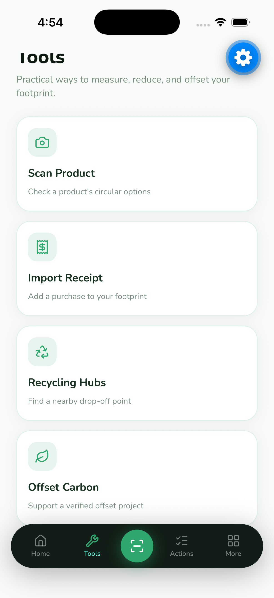
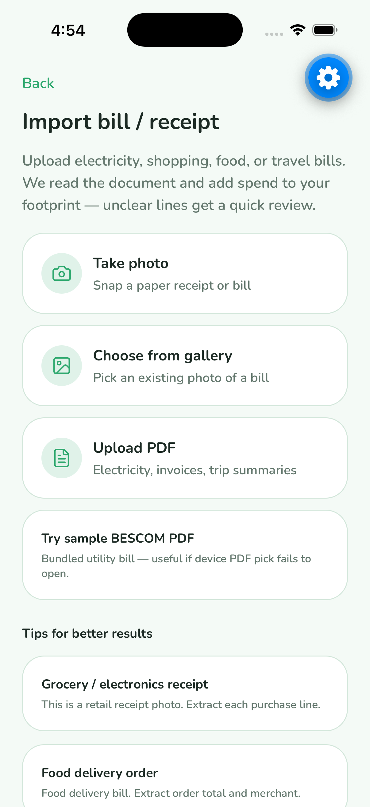
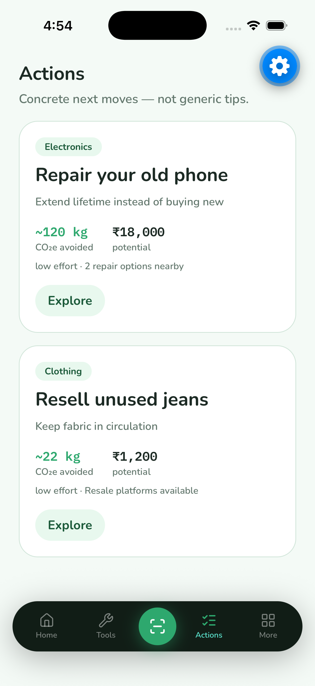
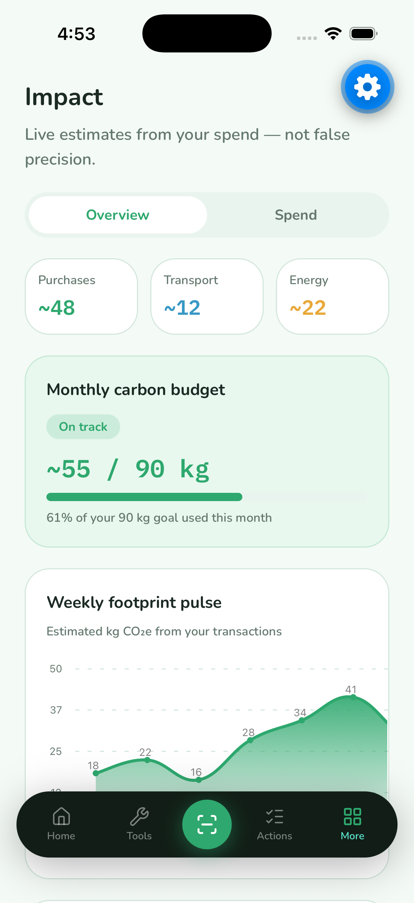
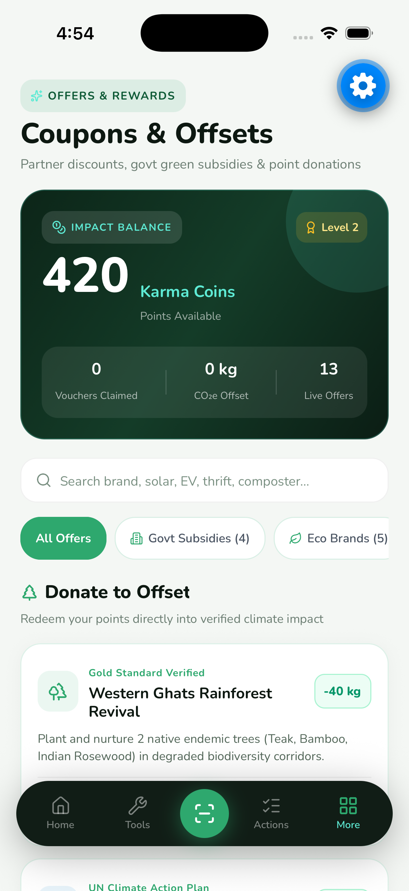
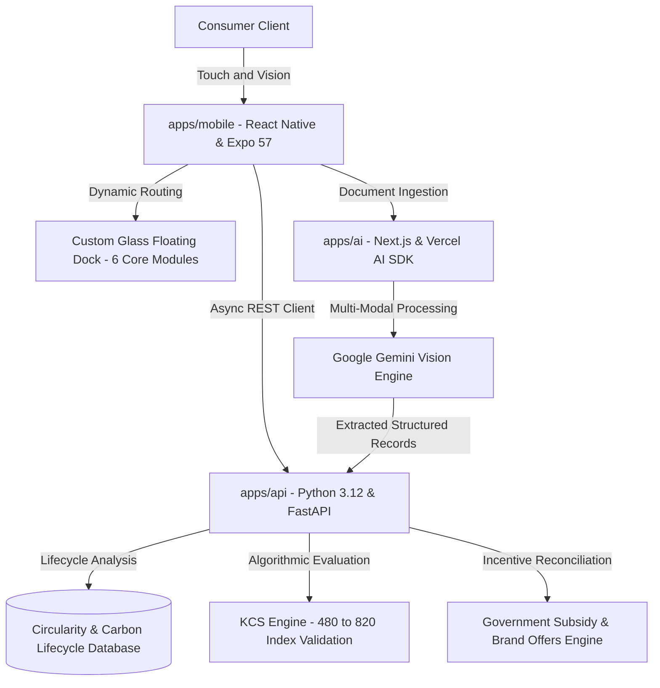

<p align="center">
  
</p>

<h1 align="center">Karma</h1>
<p align="center"><strong>The Personal Circularity Decision Engine</strong></p>
<p align="center"><em>Make what you own count for more. Scan, compare, repair, and turn everyday consumption into verifiable carbon credit scores and real-world rewards.</em></p>

<p align="center">
  
  
  
  
  
  
</p>

<br>

<p align="center">
  <a href="#hackathon-problem-statement">Problem Statement</a> &bull;
  <a href="#why-karma">Why Karma?</a> &bull;
  <a href="#app-experience">App Experience</a> &bull;
  <a href="#the-story">The Story</a> &bull;
  <a href="#core-capabilities">Core Capabilities</a> &bull;
  <a href="#the-karma-credit-score-kcs">KCS Index</a> &bull;
  <a href="#system-architecture">Architecture</a> &bull;
  <a href="#demo-sandbox-evaluator-quickstart">Demo Sandbox</a>
</p>

---

## Hackathon Problem Statement

> **THEME: CIRCULAR CARBON ECOSYSTEM**  
> **Consumer Carbon Loop App**  
>  
> **Description:**  
> Everyday consumers have little visibility into their personal carbon footprint and few easy ways to act on it. This problem asks participants to build an app that estimates a user's carbon footprint from purchases, transport, and energy use, then suggests concrete circular actions &mdash; repair vs. replace decisions, nearby recycling drop points, or verified offset options &mdash; and rewards users for taking action.  
>  
> **User:**  
> Individual consumers, eco-conscious brands, recycling facilities.  
>  
> **Impact:**  
> &bull; Raises consumer awareness of everyday carbon impact.  
> &bull; Drives behavior change toward circular consumption habits.  
> &bull; Creates a channel for brands to reward sustainable customer behavior.  
>  
> **Tech that can be used:**  
> &bull; Mobile app development  
> &bull; Transaction categorization (NLP/ML)  
> &bull; Location-based APIs (recycling points)  
> &bull; Gamification engines  

---

## Why Karma?

The name **Karma** is rooted in the universal principle of cause and effect: every action inevitably generates a consequence. In modern consumer society, every purchase, discard, and replacement decision ripples through global supply chains, extraction networks, and municipal waste streams.

For decades, digital environmental tools have treated this dynamic as an inescapable burden of guilt. They have presented consumers with abstract metric tons of emissions, urged austerity, and demanded that individuals simply consume less. But guilt is not an effective catalyst for long-term behavioral transformation, and deprivation cannot build sustainable habits.

**Karma alters this dynamic fundamentally.**

Within this ecosystem:
* **Conscious Action Generates Direct Value**: Every beneficial circular decision &mdash; restoring a broken phone screen, keeping garments in active circulation, commuting on public transit, or depositing e-waste at a certified hub &mdash; is quantified, validated, and rewarded.
* **Circularity as an Earned Asset**: Instead of treating individuals as net-negative carbon liabilities, Karma conceptualizes circular living through the lens of creditworthiness. Members build an authoritative **Karma Credit Score (KCS)**, accumulate liquid **Karma Coins**, and unlock substantial economic benefits including verified government environmental subsidies and partner merchant incentives.
* **Closing the Economic Loop**: Constructive deeds yield tangible returns. Possessions that would otherwise enter landfills are transformed into financial utility, positioning consumers as empowered participants within a high-value circular economy.

*"Make what you own count for more."*

---

## App Experience

<table align="center" width="100%">
  <tr>
    <td align="center" width="25%">
      <br>
      <strong>1. Welcome & Onboarding</strong><br>
      <sub>Core mission & circular value proposition</sub>
    </td>
    <td align="center" width="25%">
      <br>
      <strong>2. Baseline Calibration</strong><br>
      <sub>Granular transit & shopping habits</sub>
    </td>
    <td align="center" width="25%">
      <br>
      <strong>3. Home & KCS Ring</strong><br>
      <sub>Dynamic score ring, streak & habits</sub>
    </td>
    <td align="center" width="25%">
      <br>
      <strong>4. Decision Tools</strong><br>
      <sub>Scanner, receipt, hubs & offset portals</sub>
    </td>
  </tr>
  <tr>
    <td align="center" width="25%">
      <br>
      <strong>5. AI Receipt Engine</strong><br>
      <sub>Gemini Vision document extraction</sub>
    </td>
    <td align="center" width="25%">
      <br>
      <strong>6. Concrete Actions</strong><br>
      <sub>Repair vs replace ROI & verified next moves</sub>
    </td>
    <td align="center" width="25%">
      <br>
      <strong>7. Footprint Analytics</strong><br>
      <sub>Weekly footprint pulse & category breakdown</sub>
    </td>
    <td align="center" width="25%">
      <br>
      <strong>8. Offers & Offsets</strong><br>
      <sub>Govt eco subsidies & in-app point donations</sub>
    </td>
  </tr>
</table>

---

## The Story

### The Problem: The Modern Consumption Trap
The modern consumer landscape is engineered around planned obsolescence and low-friction replacement. When a smartphone battery degrades, a garment seam splits, or a small appliance malfunctions, consumers encounter an asymmetric dilemma:

* Spend hours locating an unvetted local technician, or press **"Buy Now"** for next-morning doorstep delivery.

Historically, environmental messaging has relied on **guilt and deprivation** &mdash; instructing populations to purchase less, travel less, and sacrifice modern convenience. However, guilt fails to scale across diverse demographics. Consumers do not suffer from a lack of environmental goodwill; they lack **frictionless decision intelligence and tangible economic incentives**.

### The Solution: An Economic Engine for Circular Living
**Karma** is an AI-powered personal circularity decision engine. It replaces the mindset of deprivation with an asset-building framework:

> **"What if circularity was treated like creditworthiness &mdash; where every repaired device, salvaged garment, and conscious choice built a tangible score that unlocked verifiable economic value?"**

Karma connects everyday consumer possessions directly to the circular economy. By scanning any physical item, importing a purchase invoice, or tracking a daily transit route, Karma rapidly computes the full lifecycle equation across six distinct circular pathways &mdash; calculating precise financial savings, emissions avoided, and awarding liquid **Karma Coins** redeemable for verified government subsidies and partner merchant rewards.

---

## Core Capabilities

### 1. Six-Pathway Circularity Decision Engine
Scan any product or barcode. Karma's lifecycle engine cross-references material databases, supply-chain benchmarks, and certified local repair hubs to evaluate six parallel pathways:
* **Repair**: Precise cost estimates, vetted repair technicians in close proximity, and avoided manufacturing footprint.
* **Refurbish**: Modular component renewal options to extend operating longevity.
* **Resell**: Secondary market valuation modeling across verified circular marketplaces.
* **Donate**: Direct routing to verified local non-profit centers, shelters, and textile banks.
* **Recycle**: Geolocation navigation to certified e-waste and recycling facilities.
* **Replace**: Direct carbon and financial cost benchmarking of purchasing an equivalent new item.

### 2. Multi-Modal AI Bill and Invoice Intelligence
Using Google Gemini Vision AI and the Vercel AI SDK, Karma performs granular item extraction from physical receipts, digital tax invoices, and utility statements:
* **Itemized Carbon Attribution**: Calculates the embodied carbon footprint of individual line items from food staples to consumer electronics.
* **Warranty and Circularity Indexing**: Automatically catalogs products into a personal digital inventory, identifying repair eligibility and warranty timelines.

### 3. The Karma Credit Score (KCS &bull; 480 &ndash; 820 Index)
Modeled with the mathematical rigor of consumer credit indices, **KCS quantifies circular sustainability**:
* **Standardized Urban Baseline**: Calibrated against median urban resource consumption benchmarks (110 kg CO₂e/month) utilizing a continuous slope equation:
  $$\text{Score} = 650 + (110 - \text{TotalKg}) \times 2.2$$
* **Provisional-to-Verified Pipeline**: Incorporates anti-gaming safeguards requiring verified multi-week signal density, distinct merchant verification, and diverse category validation before unlocking scores above 680.

### 4. Real-World Government Subsidies and Brand Offers
Points in Karma function as liquid utility rewards backed by real-world environmental economic programs:
* **Government Environmental Subsidies**: Direct application vouchers for national rooftop solar installations, public electric vehicle charging credits, municipal composting equipment rebates, and urban mass transit passes.
* **Sustainable Partner Brands**: Tiered vouchers with verified circular partners, zero-waste refill networks, certified organic apparel, and diagnostic service centers.

### 5. Direct In-App Carbon Offsets (Zero Middlemen)
Users can allocate earned points directly toward certified environmental initiatives without leaving the application:
* **Western Ghats Rainforest Corridor**: Native species biodiversity corridor reforestation.
* **Sundarbans Coastal Mangrove Protection**: High-permanence coastal blue carbon restoration.
* **Community Solar Grids and Rural Biogas**: Decentralized clean energy infrastructure development.
* *Instant digital impact certification logged securely to the member's profile.*

### 6. Automated Pedestrian Step Offsets
Passive background pedometer synchronization measures zero-emission pedestrian travel, automatically computing emissions avoided compared to vehicular transit and awarding continuous impact progress.

---

## System Architecture

Karma is built as a modular monorepo structured for enterprise reliability, high-throughput analytical computation, and responsive mobile interfaces.



### Technical Stack
* **Mobile Client (`apps/mobile`)**: Expo SDK 57, React Native 0.79, UniWind (Tailwind CSS v4 engine), gluestack-ui v5 primitives, Shopify FlashList, lucide-react-native.
* **Core API (`apps/api`)**: Python 3.12, FastAPI, Pydantic v2, asynchronous lifecycle decision models, KCS algorithmic pipeline.
* **AI Extraction Microservice (`apps/ai`)**: Next.js 15, Vercel AI SDK, Google Gemini Vision API for document analysis.

---

## Demo Sandbox (Evaluator Quickstart)

For authorized evaluators, judges, and enterprise partners testing the private build:

### 1. Prerequisites
Ensure `node >= 20`, `pnpm >= 9`, and `python >= 3.11` are installed on your workstation.

### 2. Launch Services

#### Terminal 1: Core API Service
```bash
cd apps/api
python3 -m venv .venv
source .venv/bin/activate  # On Windows: .venv\Scripts\activate
pip install -r requirements.txt
uvicorn app.main:app --reload --host 0.0.0.0 --port 8000
```
*Or from workspace root:* `pnpm api`

#### Terminal 2: Multi-Modal AI Document Service
```bash
cd apps/ai
pnpm install
cp .env.example .env.local  # Configure GOOGLE_GENERATIVE_AI_API_KEY
pnpm dev
```
*Or from workspace root:* `pnpm ai` *(runs on port 8001)*

#### Terminal 3: Mobile Client
```bash
cd apps/mobile
pnpm install
npx expo start --ios  # Or --android
```

### 3. The 90-Second Hero Experience
1. **Launch App**: View your initial **Karma Credit Score (KCS)** on the dynamic progress ring.
2. **Scan Item**: Tap the center **Scan** button and input or scan demo barcode `8901030865822` (Smartphone).
3. **Compare Pathways**: Review the comparative analysis across all six circular pathways with precise cost versus emissions data.
4. **Initiate Repair**: Select **"Find Local Repair"** and register a completed action to earn **+100 Impact Points**.
5. **Redeem Offers**: Open the **Offers** tab to apply points toward a **Government Green Energy Voucher** or direct offset contribution.

---

## Proprietary and Commercial Rights

**CONFIDENTIAL AND PROPRIETARY**

Copyright &copy; 2026 Karma Technologies Inc. / Carbon Loop. All rights reserved.

This software, its system architecture, algorithms, user interfaces, scoring methodologies (including the Karma Credit Score / KCS equation), and documentation contain proprietary intellectual property and trade secrets. 

* Unauthorized copying, reverse engineering, redistribution, decompilation, public dissemination, or commercial exploitation is strictly prohibited without prior written authorization.
* **Commercial and Institutional Partnerships**: For municipal climate program integrations, brand voucher onboarding, or institutional pilot inquiries, please contact: `partnerships@carbonloop.app`.

---

<p align="center">
  <br>
  <sub><em>Accelerating the transition to a high-value circular economy.</em></sub>
</p>
