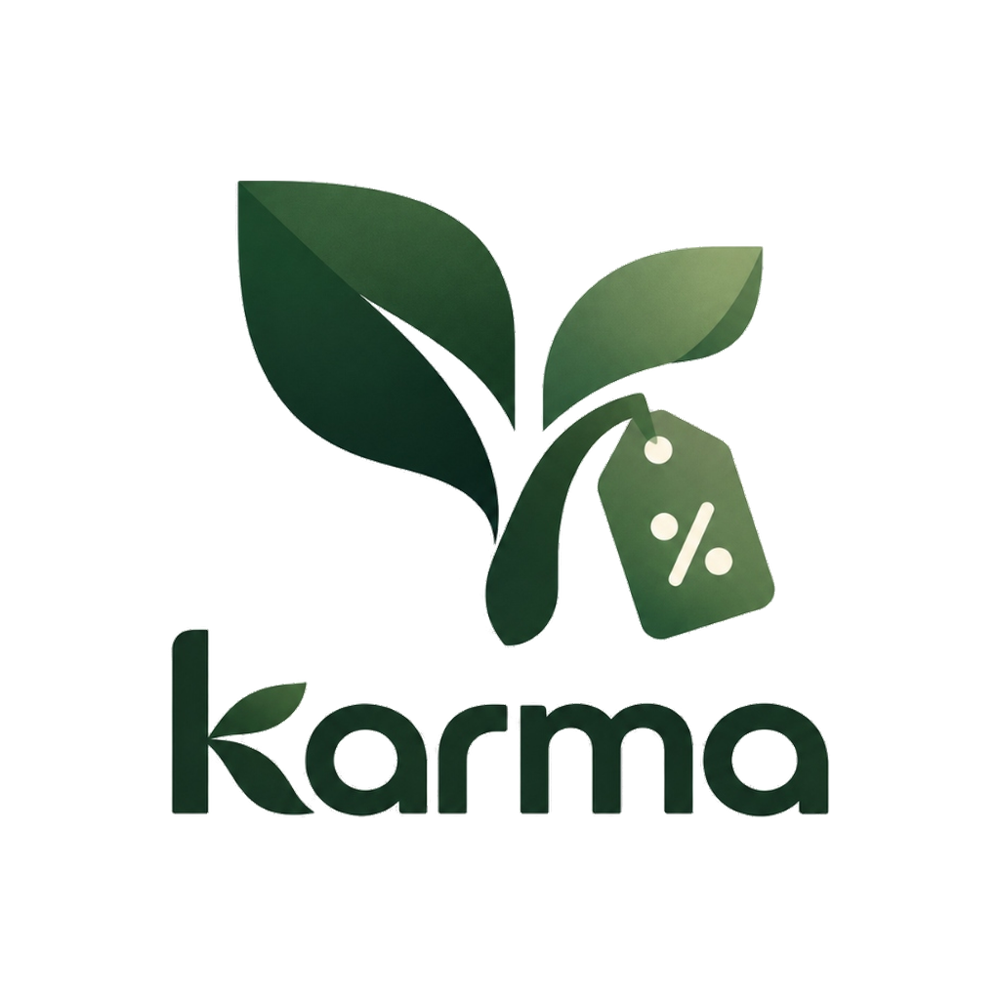
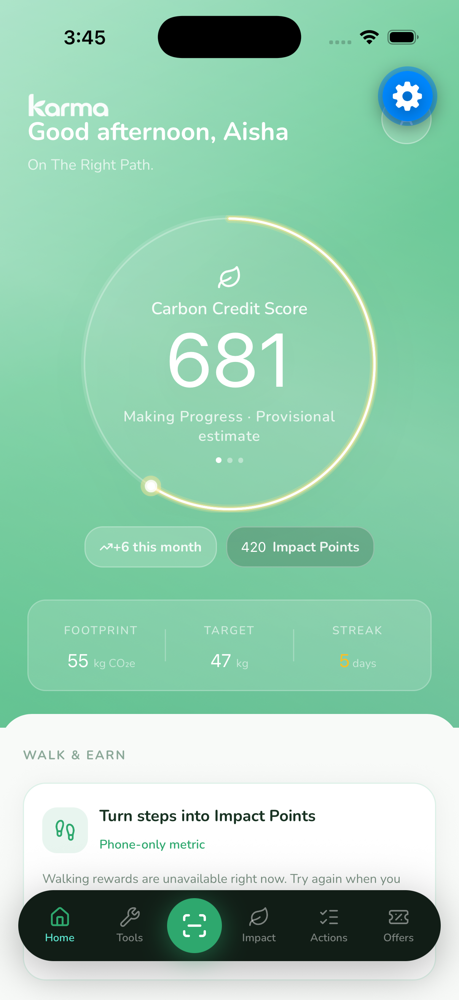
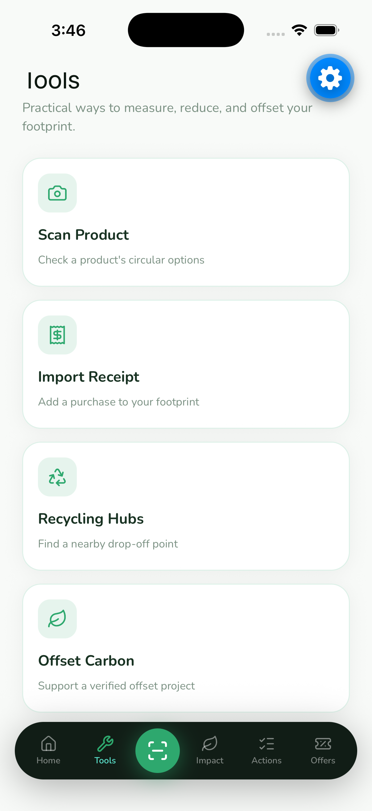
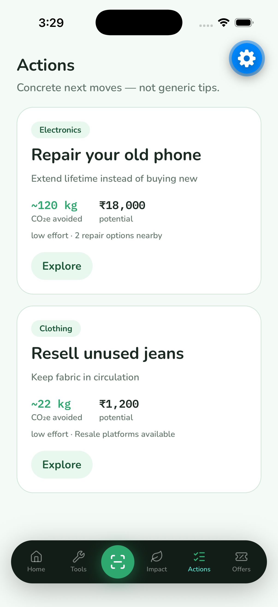
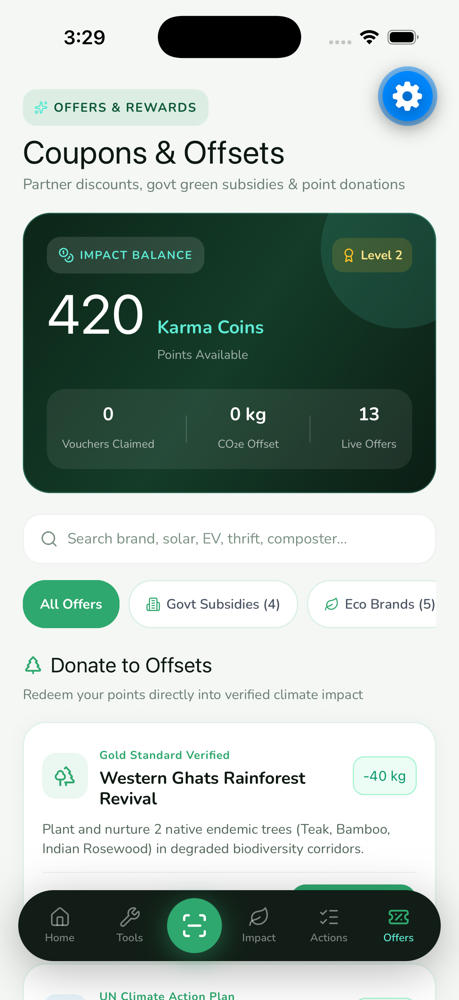
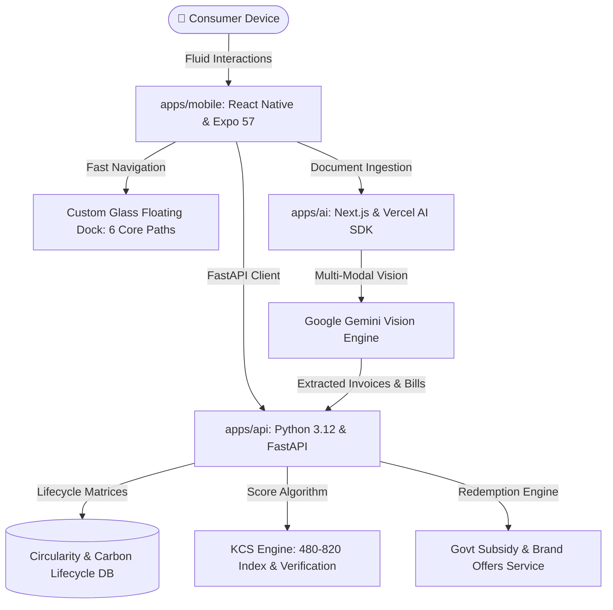

<p align="center">
  
</p>

<h1 align="center">Karma</h1>
<p align="center"><strong>The Personal Circularity Decision Engine</strong></p>
<p align="center"><em>Make what you own count for more. Scan, compare, repair, and turn everyday consumption into verifiable carbon credit scores and real-world rewards.</em></p>

<p align="center">
  
  
  
  
  
  
</p>

<br>

<p align="center">
  <a href="#the-story">The Story</a> &nbsp;•&nbsp;
  <a href="#core-capabilities">Core Capabilities</a> &nbsp;•&nbsp;
  <a href="#the-karma-credit-score-kcs">The KCS Index</a> &nbsp;•&nbsp;
  <a href="#rewards--govt-subsidies">Rewards & Subsidies</a> &nbsp;•&nbsp;
  <a href="#architecture">Architecture</a> &nbsp;•&nbsp;
  <a href="#demo-sandbox">Demo Sandbox</a>
</p>

---

## 📱 App Experience

<table align="center" width="100%">
  <tr>
    <td align="center" width="25%">
      <br>
      <strong>Dynamic KCS Ring & Habits</strong>
    </td>
    <td align="center" width="25%">
      <br>
      <strong>Circularity Decision Tools</strong>
    </td>
    <td align="center" width="25%">
      <br>
      <strong>High-Impact Circular Actions</strong>
    </td>
    <td align="center" width="25%">
      <br>
      <strong>Govt Subsidies & Offsets</strong>
    </td>
  </tr>
</table>

---

## 📖 The Story

### The Problem: The Modern Consumption Trap
The modern economy is built on planned obsolescence and friction-free replacement. When an iPhone battery degrades, a seam splits on a pair of jeans, or a toaster stops heating, consumers face a rigged equation:

* Spend hours hunting down an unverified local technician, or click **"Buy Now"** on Amazon for tomorrow morning delivery.

For decades, environmental solutions have relied on **guilt and deprivation**—telling people to stop buying, stop traveling, and live with less. But guilt does not scale. What consumers actually lack is not goodwill, but **frictionless intelligence and tangible incentives**.

### The Solution: A Financial Asset for Circular Living
**Karma** is the world’s first personal circularity decision engine. We reject the philosophy of deprivation. Instead, we ask a fundamentally different question:

> **"What if circularity was treated like creditworthiness—where every repaired gadget, salvaged garment, and conscious choice built a tangible score that unlocked cold, hard economic value?"**

Karma bridges the gap between everyday physical possessions and the circular economy. Point your phone camera at any item, import a shopping invoice, or track your commute. Within milliseconds, Karma computes the full lifecycle equation across six distinct circular pathways—quantifying exact rupee savings, avoided emissions, and awarding liquid **Karma Coins** redeemable for verified government subsidies and partner rewards.

---

## ⚡ Core Capabilities

### 1. 🔍 6-Way Circularity Decision Engine
Point your camera at any product or barcode. Karma’s lifecycle database cross-references manufacturer data, material compositions, and local repair networks to evaluate six parallel pathways:
* 🛠️ **Repair**: Exact cost breakdown, nearby vetted technicians, and avoided manufacturing emissions.
* 🔄 **Refurbish**: Component upgrade pathways to extend usable life.
* 🏷️ **Resell**: Fair market second-hand value estimation across re-commerce channels.
* 🎁 **Donate**: Matched local non-profits, shelters, and circular drop-offs.
* ♻️ **Recycle**: Verified municipal e-waste and textile processing hubs.
* 🛒 **Replace**: Environmental footprint benchmark of buying brand new.

### 2. 🧾 Multi-Modal AI Bill & Invoice Intelligence
Powered by Google Gemini Vision AI and the Vercel AI SDK, Karma reads past the receipt total. Simply snap a grocery receipt, upload an electronics tax invoice, or import a utility bill:
* **Itemized Carbon Attribution**: Calculates the embodied carbon of individual items from food staples to home appliances.
* **Warranty & Repairability Cataloging**: Automatically archives items into your personal circular closet, flagging repairability scores and warranty expirations.

### 3. ⭕ The Karma Credit Score (KCS · 480 – 820 Index)
Just as CIBIL and FICO quantify financial creditworthiness, **KCS quantifies circular sustainability**.
* **Interim Calibrated Baseline**: Standardized against median urban footprints (110 kg CO₂e/month) with a continuous slope metric:
  $$\text{Score} = 650 + (110 - \text{TotalKg}) \times 2.2$$
* **Provisional-to-Verified Pipeline**: Eliminates greenwashing through quiet anti-dumping checks requiring verified multi-week signal density, distinct merchant verification, and multi-category validation before uncapping the score above 680.

### 4. 🪙 Real-World Government Subsidies & Brand Offers
Points in Karma are not vanity badges. They are liquid utility coins redeemable for real-world environmental economic incentives:
* **Government Green Subsidies**: Direct application vouchers for national rooftop solar installations, public EV charging credits, municipal home composter rebates, and metro commuter rail passes.
* **Sustainable Partner Brands**: Exclusive discounts on certified organic apparel, zero-waste grocery refills, circular footwear, and local repair café diagnostics.

### 5. 🌳 Direct In-App Carbon Offsets (Zero Middlemen)
Users can directly contribute points to Gold Standard and UN Climate Plan certified climate initiatives:
* **Western Ghats Rainforest Corridor**: Reforestation of native biodiversity belts.
* **Sundarbans Coastal Mangrove Protection**: High-permanence blue carbon coastal restoration.
* **Community School Solar Grids & Rural Biogas**: Decentralized clean energy infrastructure.
* *Instant digital impact certification logged directly to the member's wallet.*

### 6. 👟 Passive Pedestrian Step Offsets
Zero-effort background health tracking automatically calibrates daily walking routines into avoided transit emissions, rewarding members for choosing footsteps over combustion engines.

---

## 🏗️ System Architecture

Karma is engineered as a high-throughput, modular monorepo built for enterprise scale, responsive client performance, and multi-modal intelligence.



### Stack Highlights
* **Mobile Client (`apps/mobile`)**: Expo SDK 57, React Native, UniWind (Tailwind CSS v4), gluestack-ui v5, Shopify FlashList, lucide-react-native.
* **Core API (`apps/api`)**: Python 3.12, FastAPI, Pydantic v2, asynchronous lifecycle decision trees, KCS scoring pipeline.
* **AI Extraction Microservice (`apps/ai`)**: Next.js, Vercel AI SDK, Google Gemini Vision API for document parsing.

---

## 🎮 Demo Sandbox

Document upload needs **API + AI + Mobile** at once. Prerequisites: Node.js 20+, [pnpm](https://pnpm.io/), Python 3.11+, and a [Google AI Studio](https://aistudio.google.com/apikey) API key.

### Terminal 1: Core API — port `8000`
```bash
cd apps/api
python -m venv .venv
# Windows: .\.venv\Scripts\activate
# macOS / Linux: source .venv/bin/activate
pip install -r requirements.txt
uvicorn app.main:app --reload --host 0.0.0.0 --port 8000
```
*Or from workspace root:* `pnpm api`

Demo barcode (hero phone): `8901030865822`

### Terminal 2: AI Document Service — port `8001`
```bash
cd apps/ai
pnpm install
cp .env.example .env.local
```

Edit `apps/ai/.env.local`:

```env
GOOGLE_GENERATIVE_AI_API_KEY=your_key_here
FASTAPI_BASE_URL=http://localhost:8000
AI_MODEL=gemini-3.8-flash
```

Then:

```bash
pnpm dev
```
*Or from workspace root:* `pnpm ai`

Model notes:
- Default / recommended: **`gemini-3.8-flash`**
- Override anytime with `AI_MODEL` in `.env.local`
- See [Gemini model docs](https://ai.google.dev/gemini-api/docs/models)

### Terminal 3: Mobile Client
```bash
cd apps/mobile
pnpm install
npx expo start
```
*Or from workspace root:* `pnpm mobile`

Scan the QR code with Expo Go, or press `a` / `i` for emulator. Use a **device on the same LAN** as the machines running API/AI (or an Android emulator).

The app auto-resolves hosts from Expo Metro (LAN IP on devices, `10.0.2.2` on Android emulator). Optional overrides: copy `apps/mobile/.env.example` to `apps/mobile/.env`.

### The 90-Second Hero Experience
1. **Launch App**: Observe your starting **Karma Credit Score (KCS)** on the dynamic glowing streak ring.
2. **Scan Item**: Open the center **Scan** button and trigger demo barcode `8901030865822` (Hero Smartphone).
3. **Compare Pathways**: Witness the instant comparison of all 6 circular pathways with precise ₹ cost vs kg CO₂e savings.
4. **Execute Repair**: Tap **"Find Local Repair"** and complete the diagnostic action to earn **+100 Impact Points**.
5. **Redeem Offers**: Switch to the **Offers** tab and redeem your points for an instant **Government Green Energy Voucher** or direct offset contribution.

---

## 🔒 Proprietary & Commercial Rights

**CONFIDENTIAL & PROPRIETARY**

Copyright © 2026 Karma Technologies Inc. / Carbon Loop. All rights reserved.

This software, its system architecture, algorithms, user interfaces, scoring methodologies (including the Karma Credit Score / KCS equation), and documentation contain proprietary intellectual property and trade secrets.

* Unauthorized copying, reverse engineering, redistribution, decompilation, public dissemination, or commercial exploitation is strictly prohibited without prior written authorization.
* **Commercial & Government Partnerships**: For municipal climate integrations, brand voucher onboarding, or institutional pilot inquiries, please contact: `partnerships@carbonloop.app`.

---

<p align="center">
  <br>
  <sub><em>Accelerating the world's transition to a high-value circular economy.</em></sub>
</p>
